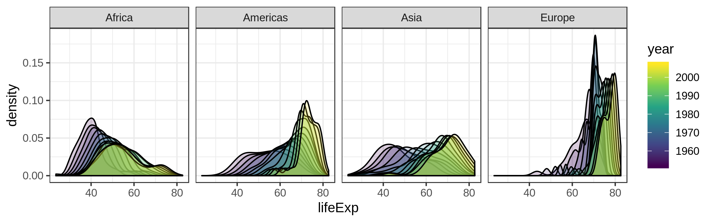
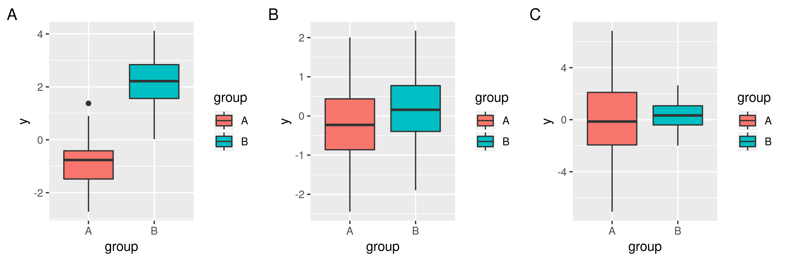
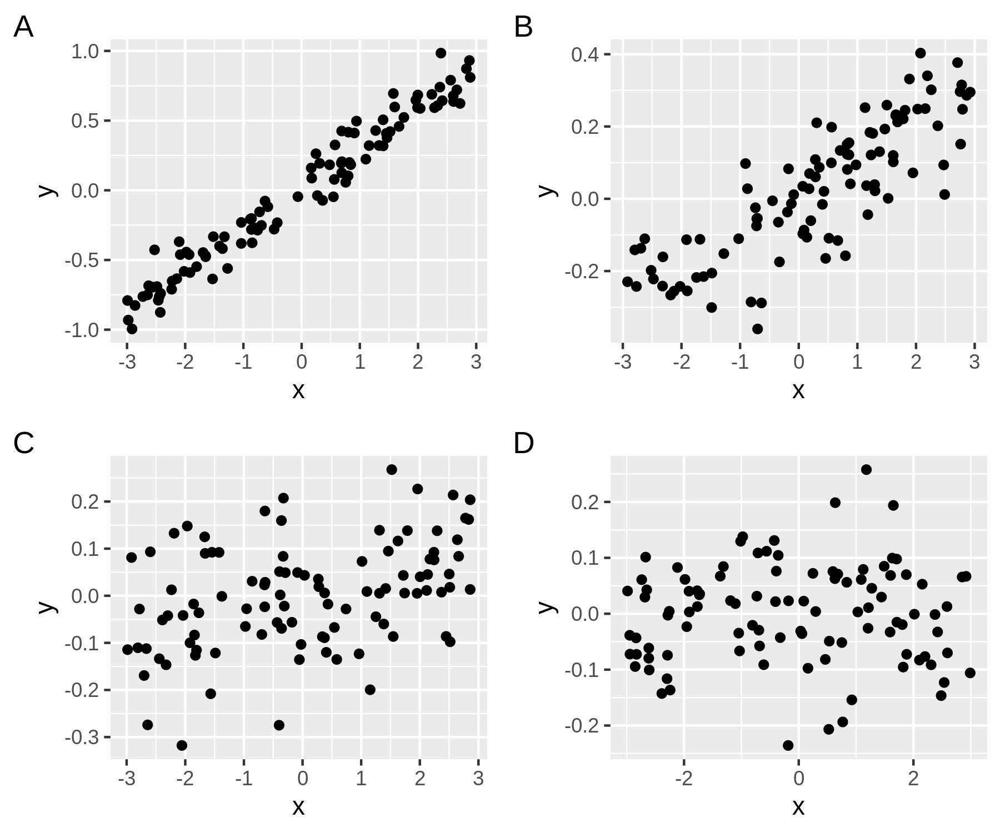
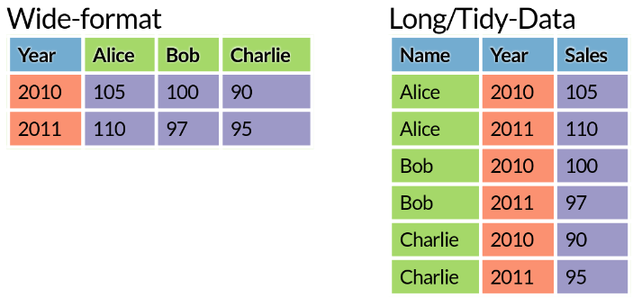
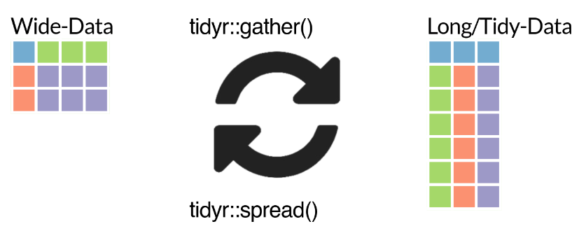
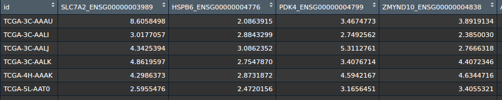
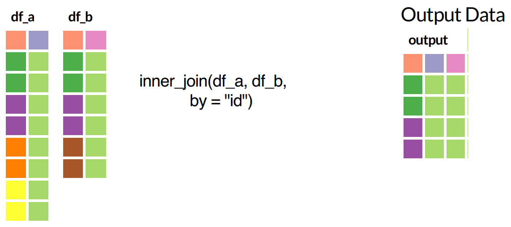
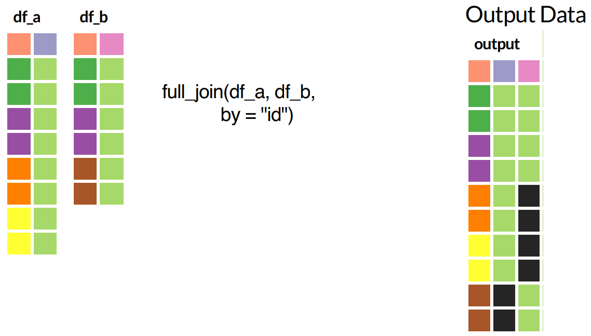
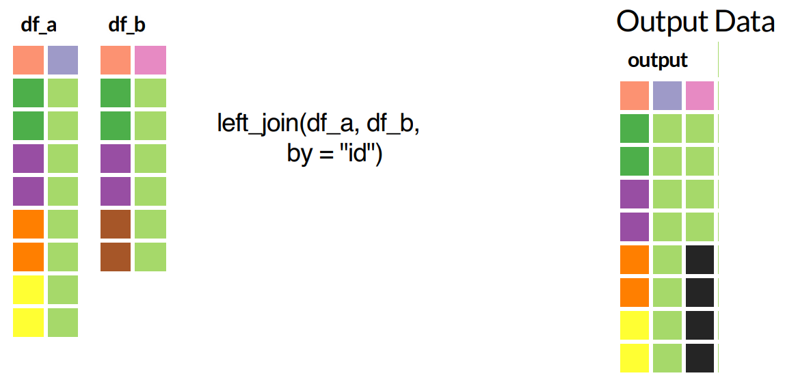

```{r setup, include=FALSE}
options(htmltools.dir.version = FALSE)
```

class: inverse

### Last time:

--

Data visualisation and ggplot2 (with examples based on gapminder data)



--

### Today:

Exploratory data analysis (using tidyverse) in practice: 

Let's try out some real data analysis on TCGA breast cancer data

--

.footnote[If there is time, we might take a look at the gganimate package]

---
class: inverse

# TCGA breast cancer data set

* Phenotypes:
    * age at diagnosis
    * ER status (estrogen-receptor-positive or negative)
    * PAM50 cancer subtype
    * etc
* Gene expression data:
    * `log(x+1)` transformed expression for all genes


Find data and notebook in https://github.com/kasparmartens/2018_12_bham

---

```{r}
df_clinical <- readRDS("data/TCGA_clinical.rds")
head(df_clinical)

df_exprs <- readRDS("data/TCGA_exprs.rds")
head(df_exprs[, 1:5])
```

---
class: inverse

## Differences between groups, focusing on a particular gene

Q1: Do ER+ and ER- patients exhibit differences in the expression of a particular gene of interest (ESR1)?

Q2: Same question about PAM50 subtypes. 

<br/>

- How would you answer these questions

  - Using numerical quantification -- which model or test would you use?
    
  - Visually -- what type of plots would you consider?

---
class: inverse

## Boxplot quiz

Is there a significant difference between the groups?



--

Do you think 

* Yes, `p < 0.05` (i.e. group means are significantly different)
* Not enough information to decide
* No, `p > 0.05`

If you choose "cannot decide", what additional information would you need?

---
class: inverse

## Correlation quiz

How strong is the correlation between the two variables? Is it significant?

.center[
  
]

--

Also, see http://guessthecorrelation.com/

---
class: inverse, middle

### So far, we focused on a single gene

### Now let's consider the expression of all genes

Before going further: a detour on tidy data (idea underlying the tidyverse)


---

# Tidy data

> “Tidy datasets are all alike, but every messy dataset is messy in its own way.” –– Hadley Wickham

1. Each variable must have its own column. 
2. Each observation must have its own row. 
3. Each value must have its own cell.

--


When unsure, we should ask ourselves: Is our data trapped in column names? Column headers should be variable names (but not values). 

---

# Tidy vs untidy data



.footnote[Source: slides by David Zimmermann]

---

# tidyr for converting between the two formats



---


Converting from wide format to tidy

```{r, eval=FALSE}
data %>%
  gather(key = "Name", value = "Sales", -year)
```

---

# Your turn

Is gene expression matrix in a tidy format? 

--

```{r, eval=FALSE}
df_exprs <- readRDS("data/TCGA_exprs.rds")
```



Convert this gene expression data into a tidy format using `tidyr::gather()`. 

---
class: inverse, middle

# dplyr for joining data frames

---
class: top
background-image: url(fig/join0.png)
background-position: 50% 60%
background-size: 40%

# Joining data frames

.footnote[Source: slides by David Zimmermann]

---
# inner_join()



---
# full_join()



---
# left_join()



---
class: inverse

# Getting insights into high-dimensional data

Now considering *all genes*. 

Q1: Do ER+ and ER- patients have generally quite different expression profiles, or are they quite similar?

Q2: Same question about PAM50 subtypes. 

<br/> 

How would you answer these questions?

---
### Briefly discussed last time:

### How to visually explore data if there are more than two or three variables?

That is, how to visualise high-dimensional data?

--

Options include:

* visualise a subset of variables, 

    * randomly selected
    
    * selection based on summary statistics

* compute summary statistics and visualise those instead

* apply a dimensionality reduction method such as PCA


---

# Why you should first visualise your data before launching your favourite ML model

--

You should have a rough idea about:

* Data quality
    * Are there any batch effects?
    * Are there possible sample mislabellings?
    * Outliers? 
* Distributions - should you apply a transformation?
* Is there a feature which explains majority of variation in the data (e.g. gender, age, batch)

--

Before fitting a fancy complicated model, you should consider starting with a simple one, to have a rough idea about:

* Expected model fit:
    * Is there strong (linear) signal? 
    * Your expected prediction accuracy (will it be close to random or close to 100%)


---
# Why you should first visualise your data before launching an ML algorithm

```{r, include=FALSE}
library(tidyverse)
library(patchwork)
n1 <- 50
n2 <- 30
sd <- 0.2
x <- c(rnorm(n1, -1, sd), rnorm(n2, 1, sd), rnorm(n1, -1, sd), rnorm(n2, 1, sd))
y <- c(rnorm(n1, -1, sd), rnorm(n2, 1, sd), rnorm(n1, -1+0.3, sd), rnorm(n2, 1+0.3, sd))
label <- rep(c("A", "A", "B", "B"), c(n1, n2, n1, n2))
batch <- rep(c("1", "2", "1", "2"), c(n1, n2, n1, n2))
df <- data.frame(pc1 = x, pc2 = y, label, batch)
```

```{r, echo=FALSE, fig.height=3.5, fig.width=11}
p1 <- df %>%
  ggplot(aes(pc1, pc2)) + 
  geom_point() + 
  theme_classic()
p2 <- df %>%
  ggplot(aes(pc1, pc2, col=label)) + 
  geom_point() + 
  theme_classic()
p3 <- df %>%
  ggplot(aes(pc1, pc2, col=batch)) + 
  geom_point() + 
  theme_classic() + 
  scale_color_brewer(palette="Set1")
```

```{r, echo=FALSE, fig.height=3.5, fig.width=11}
p1 + plot_spacer() + plot_spacer()
```

---
# Why you should first visualise your data before launching an ML algorithm

```{r, echo=FALSE, fig.height=3.5, fig.width=11}
p1 + p2 + plot_spacer()
```

---
# Why you should first visualise your data before launching an ML algorithm

```{r, echo=FALSE, fig.height=3.5, fig.width=11}
p1 + p2 + p3
```

---
class: inverse

# Data science workflow within tidyverse

.center[
  
]
